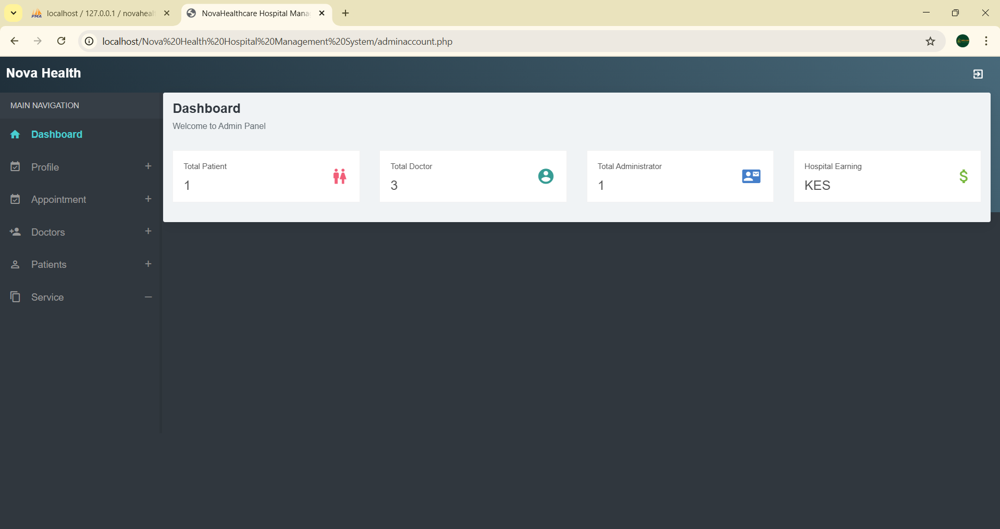
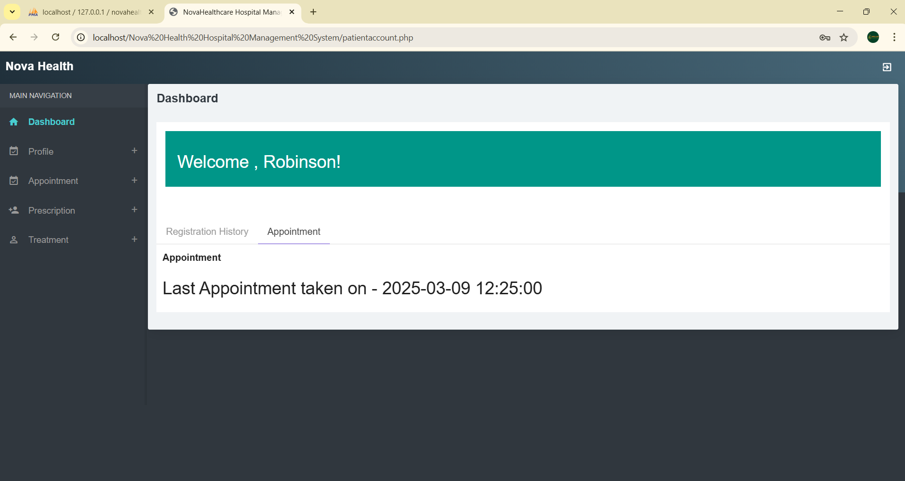

# Nova Health Hospital Management System

A PHP-based Hospital Management System built for managing hospital operations including admin control, doctor management, patient management, appointments, and medical records.

---

---

## 🔐 Login Credentials

### **👨‍💼 Admin Login**

* **Login ID:** `admin`
* **Password:** `newpassword123`

### **👨‍⚕️ Doctor Login**

* **Login ID:** `41945893`
* **Password:** `12345678`

### **🧑‍🦽 Patient Login**

* **Login ID:** `41945893`
* **Password:** `12345678`

> ⚠ Note: Doctor and Patient share the same login ID and password for demo purposes.

---

## 📸 Screenshots

Place actual image files inside a folder named **images** like this:

```
Nova Health Hospital Management System/
│ README.md
│ index.php
│ ...
└── images/
      homepage.png
      admin_dashboard.png
      doctor_dashboard.png
      patient_dashboard.png
```

### 🏠 Homepage

```

```

### 👨‍💼 Admin Dashboard

```

```

### 👨‍⚕️ Doctor Dashboard

```

```

### 🧑‍🦽 Patient Dashboard

```

```

---

## ⭐ Features Overview Table

| Module      | Features                                                               |
| ----------- | ---------------------------------------------------------------------- |
| **Admin**   | Manage doctors, patients, appointments, view reports                   |
| **Doctor**  | View assigned patients, manage prescriptions, update treatment details |
| **Patient** | Book appointments, view medical history, update profile                |
| **System**  | Secure authentication, session management, MySQL database support      |

---

## 🛠️ Tech Stack

| Technology        | Description              |
| ----------------- | ------------------------ |
| **PHP**           | Backend scripting        |
| **MySQL**         | Database engine          |
| **HTML, CSS, JS** | Frontend UI              |
| **XAMPP**         | Local development server |
| **Bootstrap**     | User interface layout    |

---

## 📥 Installation Instructions

### **1️⃣ Install XAMPP**

Download and install XAMPP (PHP 7+ recommended).

### **2️⃣ Move Project Into htdocs**

Place your folder here:

```
C:/xampp/htdocs/Nova Health Hospital Management System
```

### **3️⃣ Create Database**

1. Open **phpMyAdmin**
2. Create a new database named:

```
novahealth
```

3. Import the SQL file located inside the project folder:

```
database/novahealth.sql
```

### **4️⃣ Update dbconnection.php**

Should look like this:

```php
$con = mysqli_connect("localhost", "root", "", "novahealth");
```

### **5️⃣ Start the Project**

Run the project in your browser:

```
http://localhost/Nova Health Hospital Management System
```

---

## 📄 License

This project is for educational and demonstration purposes.

---

## 📞 Developer

**Craig Robinson Onganga**


Just tell me!
